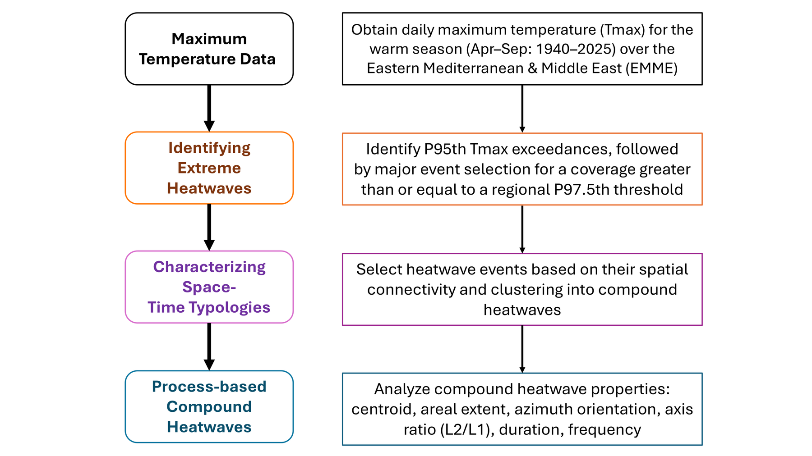
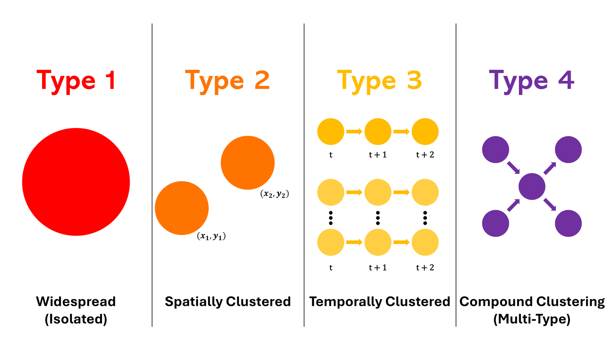

# scoRch.generator

[](https://github.com/fawazbouhamad/scoRch.generator/actions/workflows/R-CMD-check.yaml)
[](LICENSE.md)

**scoRch.generator** finds large, regionally extensive heatwaves in gridded
daily maximum temperature and classifies them into four space-time types. It
is the R implementation of **SCORCH** (Spatiotemporal Classification of
Regional Compound Heatwaves), the method of *Understanding Compound Space-Time
Typologies of Large-Scale Extreme Heatwaves* by Fawaz Bouhamad and Nasser
Najibi (manuscript in preparation).

## Quick start

| | |
|---|---|
| **You provide** | ERA5 2-m temperature downloaded as NetCDF (hourly or daily; one file, several files or a folder), or a file of daily maximum temperature |
| **You may edit** | `scorch_config.yaml`, the one configuration file. It starts with the settings of the SCORCH study; change only what your application needs |
| **You run** | `run_scorch("scorch_config.yaml")` |
| **You get** | catalogs, tables, statistical models, figures and a run summary in `scorch_output/` |

```r
library(scoRch.generator)
write_scorch_config("scorch_config.yaml")   # 1. an editable copy of the SCORCH configuration
                                            # 2. in scorch_config.yaml, set  input: file: 'my_era5_folder'
run_scorch("scorch_config.yaml")            # 3. the complete SCORCH analysis
```

That one command reads and prepares the ERA5 data (daily maxima, degrees
Celsius, 1-degree cells), runs every SCORCH stage, fits the models, chooses
the representative events, draws the figures and writes everything to the
output folder. You never edit the package's R source files: every setting a
user can change is in `scorch_config.yaml`. The [`demo/`](demo) folder shows
the whole workflow on the example data.

## What it does

<p align="center"></p>

*Workflow artwork by Bouhamad and Najibi, CC BY 4.0, from the
[reproducibility repository](https://github.com/fawazbouhamad/compound-heatwave-typologies-SCORCH).*

1. **Local heatwaves** in every grid cell: days at or above the cell's
   95th-percentile Tmax, in runs of at least 3 days with single-day gaps
   bridged (Catalog 1).
2. **Regionally extensive days**: dates whose number of heatwave cells reaches
   the 97.5th percentile of all days (Catalog 2).
3. **Clusters** of the heatwave cells on each selected day with DBSCAN, whose
   neighbourhood settings are chosen by a parameter search and pooled over
   consecutive days (Catalog 3).
4. **Ellipses** fitted to each cluster by principal components, with
   temperature-weighted centroids (Catalog 4).
5. **Compound heatwave events**: consecutive selected days, classified into the
   four types below (Catalog 5 and Table 1).

The largest ellipse areas are then fitted with a power law, and the centroids
with a log-Gaussian Cox process whose intensity map shows where large
heatwaves concentrate.

<p align="center"></p>

*Typology artwork by Bouhamad and Najibi, CC BY 4.0. Type 1 has one selected day and one cluster;
Type 2 has one selected day and several clusters; Type 3 has several days that consistently have
one cluster or consistently have several; Type 4 mixes daily cluster counts, including a selected
day on which no cluster forms.*

## Installation

The package is pure R (no compilers needed) and installs its dependencies
(`dbscan`, `maps`, `ncdf4`, `spatstat.geom`, `spatstat.model`, `yaml`)
automatically. R 4.1 or newer is required.

```r
install.packages("remotes")
remotes::install_github("fawazbouhamad/scoRch.generator")
```

## Try the example

The package ships an example dataset: a 16 x 16 cell subset of the study's
processed ERA5 temperature (38.5-53.5 E, 22.5-37.5 N, April-September
1996-2025; see `inst/extdata/README.md` for its source and licence).

```r
library(scoRch.generator)
scorch_template("scorch_config.yaml", fast = TRUE)  # 1. write a config for the example data
run_scorch("scorch_config.yaml")                    # 2. run; results appear in scorch_output/
```

The run takes well under a minute and prints what it found. `fast = TRUE`
writes a clearly labelled **fast demonstration** with 200 bootstrap
repetitions in the power-law analysis instead of the study's 5000; it is for
learning and testing, not for results. The same example, with the study's
settings, is in [`demo/`](demo): one configuration file and one command.

## Use your own data

### 1. Provide the temperature data

#### ERA5 (recommended)

Download ERA5 2-m temperature from the
[Copernicus Climate Data Store](https://cds.climate.copernicus.eu) in NetCDF
format and set `input: file` to the file, a list of files, or the folder that
holds them. The package prepares it exactly as the SCORCH study did.

| Item | Accepted |
|---|---|
| Product | *ERA5 hourly data on single levels*, variable *2m temperature* (`t2m`); or *ERA5 post-processed daily statistics*, daily maximum of *2m temperature* |
| Format | NetCDF (`.nc`), as downloaded; GRIB is not read |
| Time step | hourly, any step that divides a day (for example 3-hourly), or daily |
| Region | the area to analyse, downloaded with its edges included (for the study: North 46, West 20, South 10, East 70); regular 0.25-degree ERA5 grid |
| Files | one file, several files (for example one per year or month), or a folder of `.nc` files; each file holds whole days (UTC) on the same grid, and no date appears in two files |
| Contents | `t2m` in Kelvin with the dimensions `longitude`, `latitude` and `valid_time` (current CDS) or `time` (older CDS files); packed values, missing values and the ERA5/ERA5T `expver` dimension are handled |

The package then, for the analysed months only:

1. takes the **maximum of each UTC calendar day** at every ERA5 grid point
   (every analysed day must be complete, e.g. 24 hours);
2. converts **Kelvin to degrees Celsius**;
3. **averages the daily maxima to 1-degree cells** (`era5_cell_size_deg: 1`):
   a cell holds the points `k <= coordinate < k + 1` in both directions and
   only complete cells are kept, so a 20-70 E, 10-46 N download gives the
   50 x 36 study cells. Longitudes from 0 to 360 are converted to -180 to 180,
   and north-to-south latitudes are put in order.

`run_summary.txt` records this preprocessing. The R function behind it,
`read_era5()`, can also be used on its own.

#### Daily maximum temperature

One NetCDF file with daily maximum temperature on a regular
longitude-latitude grid (`format: daily_tmax`, chosen automatically when the
file has no `t2m` variable), used as it is:

| Item | Requirement |
|---|---|
| Variable | Daily maximum temperature, 3 dimensions: time, latitude, longitude (any order) |
| Units | `units` attribute `degC` or `K` (Kelvin is converted), or set `units` in the config |
| Coordinates | Cell centres in degrees, evenly spaced; the grid step is read from the file |
| Time | `days since YYYY-MM-DD` (or hours/minutes/seconds since), standard Gregorian calendar; all days of the year or only the warm season |
| Missing values | `_FillValue`/`missing_value` attribute. Cells missing on every date (for example sea cells) are excluded; any other gap stops the run, because the method needs a complete record |

The study's temperature-weighted centroids use Celsius Tmax as weights. Every
cluster cell must therefore have positive Celsius Tmax. A colder region needs
a different, explicitly chosen weighting rule before this stage can be used.

The study's processed file, `scorch_data/tmax_processed.nc` in `SCORCH_data.zip`
(Zenodo, version 1.0.0, [doi:10.5281/zenodo.21717874](https://doi.org/10.5281/zenodo.21717874)), works as is. Data already in R (for example from another file format) can be
wrapped with `tmax_from_array()` and passed as
`run_scorch("scorch_config.yaml", tmax = my_tmax)`, or as
`run_scorch(tmax = my_tmax)` to use the study settings unchanged. The
configuration's warm-season months and date limits apply to this R input too.

### 2. Choose the settings

The package ships with the configuration of the SCORCH study, and its
settings are the defaults. Run with them as they are, or change individual
settings for your own application. Write an editable copy to your working
folder:

```r
write_scorch_config("scorch_config.yaml")   # the study settings, 5000 bootstrap repetitions
```

Open the file in any text editor. Every setting is commented. Set
`input: file` to your data; you normally change only that and the output
folder. A setting you delete from the file keeps its study value. These are
all the settings:

| Setting | Meaning | Study default |
|---|---|---|
| `input: file` | your ERA5 file, list of files or folder, or a daily maximum temperature file | - |
| `input: format` | `era5`, `daily_tmax`, or `auto` (ERA5 when the file has `t2m`) | auto |
| `input: variable`, `longitude`, `latitude`, `time`, `units` | names in the file and temperature units; found automatically unless set | auto |
| `input: era5_cell_size_deg` | ERA5 only: cell size (degrees) to which the daily maxima are averaged; `null` keeps the ERA5 grid | 1 |
| `output: directory` | folder for the results | `scorch_output` |
| `period: warm_season_months` | months analysed; `start_date`, `end_date` limit the period | April-September |
| `heatwaves` | local threshold percentile, minimum duration, minimum exceeding days | 95, 3, 3 |
| `regional_days: percentile` | percentile of daily heatwave-cell counts that selects a day | 97.5 |
| `clustering` | candidate DBSCAN distances (grid-cell units) and minimum sizes | 1-4 by 0.5; 4-12 |
| `ellipses: scale_factor` | ellipse semi-axis per principal standard deviation | 1.25 |
| `power_law` | bootstrap repetitions and seeds | 5000 |
| `lgcp` | trend covariates, raster pixel size, window margin | lon, lat, mean and SD of Tmax; 25 km; 80 km |
| `figures: representative_events` | events shown in the single-day and multi-day example plots; `null` = longest event of each type | automatic |

### 3. Run

```r
run_scorch("scorch_config.yaml")
```

### 4. Open the results

```
scorch_output/
  catalogs/   1_heatwave_events.csv          Catalog 1: every local heatwave
              2_regional_days.csv            Catalog 2: selected days and their cells
              2_regional_day_cells.csv
              3_clusters.csv                 Catalog 3: DBSCAN clusters and cell membership
              3_cluster_cells.csv
              4_ellipses.csv                 Catalog 4: ellipse geometry and weighted centroids
              5_compound_events.csv          Catalog 5: compound events with their type
              5_event_days.csv
  tables/     table_1.csv                    statistics by type (Table 1 of the study)
              cell_thresholds.csv            local thresholds and counts per cell
              daily_heatwave_extent.csv      heatwave cells on every day, regional threshold
              duration_trends.csv            trend tests on Type 3 and Type 4 durations
  models/     power_law_fits.csv             cutoffs, exponents, bootstrap p-values
              lgcp_parameters.csv            trend coefficients, field variance, scale
              lgcp_intensity.csv             mean intensity and concentration rank per cell
              lgcp_centroid_concentration.csv  share of centroids in the top-20% and 50% zones
  figures/    ellipse_spatial_patterns.png    maps of ellipse axes, overlap and geometry
              single_day_events.png          examples of Type 1 and Type 2 events
              consistent_multiday_events.png example of a Type 3 event
              mixed_multiday_events.png      example of a Type 4 event
              ellipse_geometry_by_type.png   geometry histograms and box plots
              event_geometry_distributions.png  geometry distributions by event type
              annual_event_counts_and_duration.png  event counts and duration trends
              ellipse_area_power_law.png     fitted area distributions
              centroid_concentration.png     fitted centroid intensity map
  run_summary.txt                            settings, counts and model results of the run
```

Plots adapt to your region, period and the event types present; a plot
whose events do not exist is skipped with a reason in `run_summary.txt`. An
LGCP fit can also be unavailable for sparse datasets; the summary records why
and its dependent plot is skipped. The paper's workflow,
threshold diagnostic (Figure 2) and typology artwork are not generated as
results. A run with no clusters writes only partial catalogs and tables, with
an incomplete-run summary; it replaces old package-generated output so stale
results cannot appear to belong to the new run. `run_scorch()` also returns the
results in R, where `scorch_figure(result, name = "mixed_multiday_events")` redraws a plot and the
stage functions (`read_era5()`, `read_tmax()`, `detect_heatwaves()`, `select_regional_days()`,
`cluster_heatwaves()`, `fit_ellipses()`, `classify_events()`,
`fit_power_law()`, `fit_lgcp()`) can be run one at a time.

## Verification

The R implementation was checked against the study's independent
reproducibility workflow: with the study's final processed input and settings
it reproduces all 176,061 local heatwaves, 395 selected days, 753 clusters,
753 ellipses (geometry to 1e-9, centroids to 1e-7), 51 compound events,
Table 1, the power-law cutoffs, exponents and bootstrap p-values, and the LGCP
parameters (to 1e-6). The test suite (`tests/testthat`) covers the
calculations with fixtures taken from the final reference catalogs, the ERA5
preprocessing, and the complete example workflow; the full-study comparison
runs when `SCORCH_REFERENCE_DIR` names the final reference.

**Preprocessing correction.** The study's first processed input (historical,
superseded Zenodo record doi:10.5281/zenodo.21717752) contained a partial northern boundary cell: the
historical ERA5 extraction ended at 45.0 N while the 1-degree aggregation
retained a cell centred at 45.5 N, so that row averaged only the four
0.25-degree points at 45.0 N. The final input (doi:10.5281/zenodo.21717874)
builds every 1-degree cell from the full 4 x 4 set of native ERA5 points; only
the 50 cells of the 45.5 N row differ. The correction changes some event
classifications and summary statistics (753 instead of 760 clusters; three of
the 51 compound events change type, giving 3/3/20/25 events of Types 1-4
instead of 3/4/20/24) but not the principal qualitative conclusions. The
historical input and results remain archived for audit; the historical
analysis is still reproduced when `SCORCH_HISTORICAL_REFERENCE_DIR` names it.

`read_era5()` applies the same complete-cell rule. On hourly ERA5 for 9-10
August 2001, from the same source the study used, it reproduces the final
input in all 1,800 cells to 1e-5 degrees C (2e-4 degrees C from 16-bit packed
CDS files, their storage precision).

## Citation

Until the manuscript is published, please cite:

Bouhamad, F., and Najibi, N. *Understanding Compound Space-Time Typologies of
Large-Scale Extreme Heatwaves*. Manuscript in preparation.

```bibtex
@unpublished{bouhamad_najibi_scorch,
  title  = {Understanding Compound Space-Time Typologies of Large-Scale Extreme Heatwaves},
  author = {Bouhamad, Fawaz and Najibi, Nasser},
  note   = {Manuscript in preparation},
  url    = {https://github.com/fawazbouhamad/compound-heatwave-typologies-SCORCH}
}
```

and the software (see `CITATION.cff`). Data derived from ERA5 contain modified
Copernicus Climate Change Service information; cite Hersbach et al. (2020).

## Support and contributing

- Problems installing or running the package: open an issue in the
  [Issues tab](https://github.com/fawazbouhamad/scoRch.generator/issues).
- Scientific questions: contact Fawaz Bouhamad or
  [Nasser Najibi](https://nassernajibi.com/).
- Contributions are welcome; see [CONTRIBUTING.md](CONTRIBUTING.md).

## Licence

Code: [GPL-3.0](LICENSE.md). The example data are CC BY 4.0 for the authors'
processing and contain modified Copernicus Climate Change Service information
2026 under the [Copernicus licence](https://ecds.ecmwf.int/licences/licence-to-use-copernicus-products).
The workflow and typology artwork above are CC BY 4.0 by the authors. Map outlines come
from Natural Earth (public domain) through the `maps` package.

**Disclaimer:** the software is provided *as is*, without warranty of any
kind. The authors are not liable for damages arising from its use. The views
expressed here are those of the authors and do not necessarily reflect those
of funding agencies, affiliated universities or the U.S. Government.
